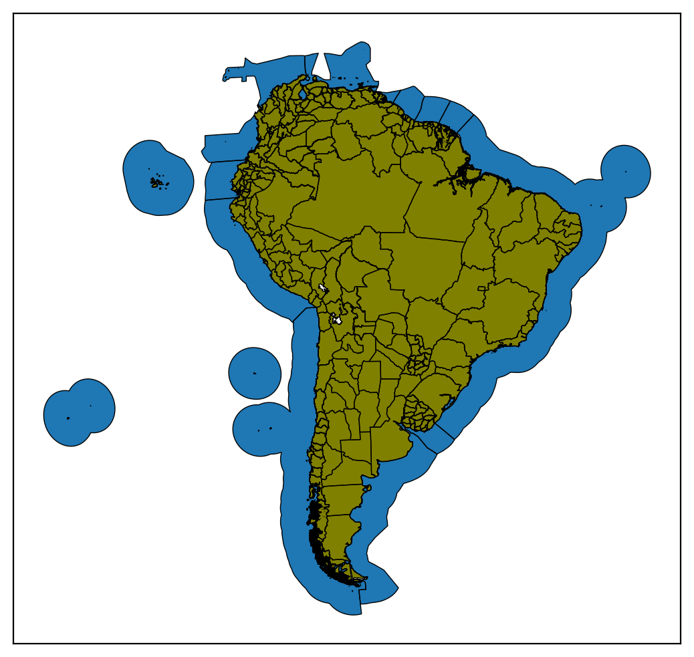
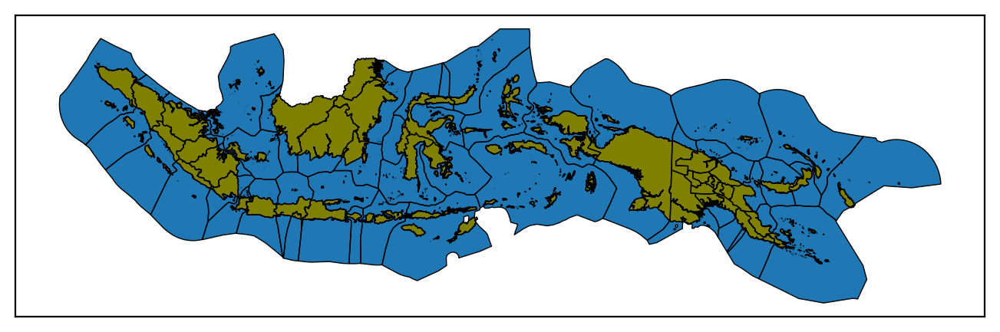
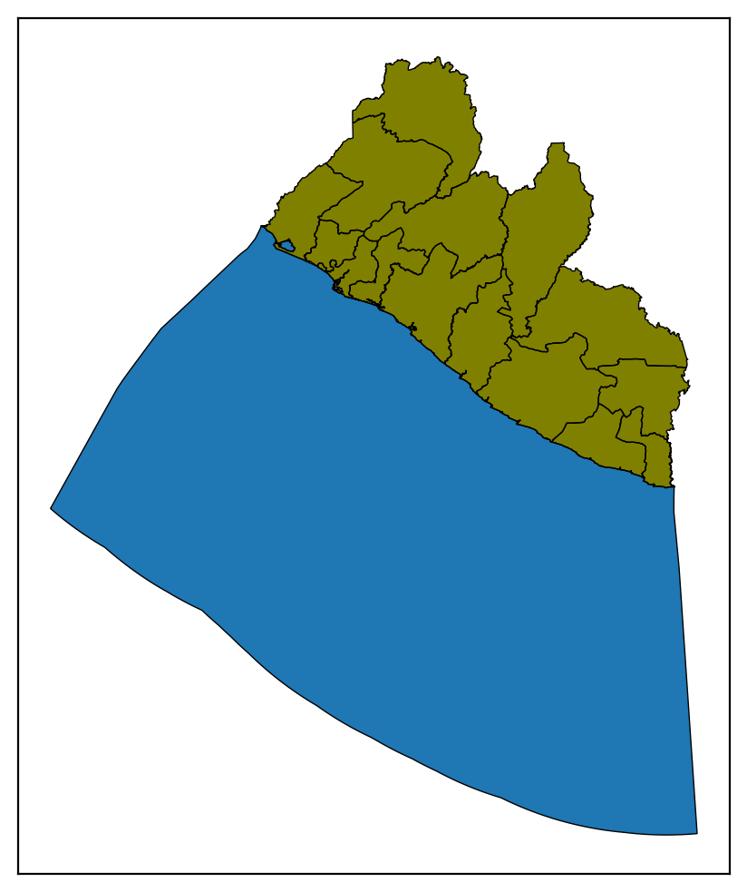

# Geospatial shapes test bench

A workflow that generates a set of reusable geopolitical shape files for Modelblocks testing.

The dataset is available at <https://doi.org/10.5281/zenodo.20765042>.


## About
<!-- Please do not modify this templated section -->

This is a `snakemake` workflow created as part of the [Modelblocks project](https://www.modelblocks.org/).
It was created to support integration testing across modules.

The country combinations are arbitrary, were tailored to vary the computational expense of Modelblocks modules, and do not represent any particular geopolitical alliance. They belong to three broad types:

- L: large datasets meant to stress module processing.
These often contain more than 10 countries.
We recommend using these for local execution only.

<p align="center">
  
</p>

- V: medium datasets with split EEZ regions (using Voronoi).
These often contain from 2 to 5 countries.
We recommend these for general development and debugging.

<p align="center">
  
</p>

- S: small datasets that _always_ have only a single country.
Meant to assist with integration testing.

<p align="center">
  
</p>

For more information, please consult the Modelblocks [documentation](https://modelblocks.readthedocs.io/en/latest/),
and the `snakemake` [documentation](https://snakemake.readthedocs.io/en/stable/snakefiles/modularization.html).

## Overview

Data processing steps:

1. The `geo_boundaries` module is executed for a set of scenarios.
2. Example figures and summary reports are created afterwards.

## Configuration

Please consult the configuration [README](./config/README.md) for a general overview on the configuration options available.

## Input / output structure

No inputs are necessary.

Results will be placed in `results/shapes/{scenario}.parquet`.

## Development
<!-- Please do not modify this templated section -->

We use [`pixi`](https://pixi.sh/) as our package manager for development.
Once installed, run the following to clone this repository and install all dependencies.

```shell
git clone git@github.com:modelblocks-org/geospatial_shapes_test_bench.git
cd geospatial_shapes_test_bench
pixi install --all
```

For testing, simply run:

```shell
pixi run test-integration
```

To test a minimal example of a workflow using this module:

```shell
pixi shell    # activate this project's environment
cd tests/integration/  # navigate to the integration example
snakemake --use-conda --cores 2  # run the workflow!
```

## References
<!-- Please provide thorough referencing below -->

This module is based on the following research and datasets:

* Ruiz Manuel, I. Modelblocks - module_geo_boundaries [Computer software]
* eurostat NUTS (various years). Nomenclature of territorial units for statistics (NUTS).
    - License: reuse is authorised provided the source is acknowledged. <https://ec.europa.eu/eurostat/statistics-explained/index.php?title=Copyright/licence_policy>
- geoBoundaries. William & Mary geoLab.
    - License: CC-BY 4.0 compliant versions were used to create files.
    Consult their documentation for details.
    <https://www.geoboundaries.org/>.
- Marine Regions World EEZ v12 (2023). Flanders Marine Institute (MarineRegions.org).
    - License: CC-By. See <https://www.marineregions.org/disclaimer.php>.
